# Matrix Weather Clock

A wall clock on a 64x32 HUB75 LED matrix that also shows local weather and US National Weather Service (NWS)
emergency weather alerts. Runs on the Seengreat **RGB Matrix HUB75 S3** controller (ESP32-S3), fetches weather from
Open-Meteo and alerts from api.weather.gov, plays a chime through the board's speaker output when a new alert
arrives, and is configured entirely through its own web interface.

> Status: running on real hardware (the controller and panel listed below). The panel driver, WiFi setup, weather,
> NWS alerts, web interface, OTA and self-update are in daily use. The alert chime, thumb-wheel keys, lightning feed
> and Pushbullet have been built but not yet confirmed on hardware; reports welcome. Other 64x32 panels may need the
> driver settings in [Troubleshooting](#troubleshooting).

## Features

- **Clock** in a fixed-cell 7x11 digit font (no jitter), 12/24-hour, AM/PM or seconds, blinking colon. Time comes
  from NTP and is kept in the on-board PCF85063 real-time clock, so the display is correct right after a power cut.
- **Weather** from [Open-Meteo](https://open-meteo.com/) (free, no API key): current temperature, feels-like,
  humidity, wind, gusts, conditions with a weather icon, and a three-day forecast screen with highs and lows.
  Imperial or metric units.
- **NWS alerts** from [api.weather.gov](https://www.weather.gov/documentation/services-web-api) for your
  coordinates: severity-coloured scrolling banner (red for Extreme/Severe, orange Moderate, yellow Minor), a flashing
  frame for the first minute, automatic expiry, cancellation and de-duplication of updates, a severity filter and an
  ignore list for event types you do not care about.
- **Sounds** through the ES8311 codec and speaker connector: fourteen synthesized patterns, from a gentle two-tone
  chime, doorbell and arpeggio to alarm-clock beeps, three sirens, the NOAA 1050 Hz warning tone and a simulation of
  the EAS attention signal (with or without the SAME data bursts). Extreme alerts such as tornado warnings get their
  own sound; volume, quiet hours and optional repeats while an alert stays unacknowledged.
- **Spoken announcements**: after the chime a natural English voice says what happened: "Tornado Warning",
  "Lightning nearby", "Alarm", "Timer finished". The clips come from a voice pack rendered with Piper TTS that the
  clock downloads once from the update site; no speech synthesis runs on the ESP32.
- **Display control**: manual brightness, day/night schedule, night mode (very dim, clock only), gamma, colours,
  page order and timing.
- **Web UI** with setup access point and captive portal, mDNS (`matrixclock.local`), REST API, WiFi scanner,
  test buttons (panel pattern, fake alert, chime), log viewer and over-the-air firmware update.
- **Lightning**: live strikes from the Blitzortung.org network (optional, via the community MQTT relay). Strikes within
  your radius show a bolt next to the clock, a flash across the panel, a "LIGHTNING 8MI NW 3M" page and an optional chime.
- **Alarms and timer**: four alarms with weekday selection and label, a countdown timer; snooze or stop with the wheel.
- **Messages**: `POST /api/message` scrolls any text on the clock with an optional chime, for Home Assistant, scripts or
  phone shortcuts.
- **More screens**: 12-hour temperature and rain-chance graph, sunrise/sunset page, brightness that follows the sun.
- **Polish**: pages slide in, rain/snow/lightning animate behind the weather, holiday colour themes with confetti, snow,
  hearts or sparkles on the day.
- **Pushbullet**: new weather alerts, nearby lightning and alarms pushed to your phone; pushes sent to the clock
  (from the phone app, IFTTT or scripts) scroll on the panel.
- **Indoor sensor**: plug a BME280, BMP280 or BME680 into the I2C header and the clock shows indoor temperature,
  humidity and barometric pressure with rising / falling arrows, keeps 24 hours of history and charts it in the web UI.
- **Live view** of the panel in the web UI, settings backup and restore.
- **Buttons**: the board's thumb-wheel switch changes pages, acknowledges alerts, stops or snoozes alarms, refreshes data.

## Hardware

| Part | Notes |
|---|---|
| [Seengreat RGB Matrix HUB75 S3](https://seengreat.com/wiki/214/rgb-matrix-hub75-s3) (SKU 260612) | ESP32-S3-WROOM-1-N16R8: 16 MB flash, 8 MB PSRAM, native USB-C, ES8311 codec, ES7210 mic ADC, speaker amp, PCF85063 RTC, PCA9557 thumb-wheel switch, micro-SD. [Controller used in this build (Amazon)](https://www.amazon.com/dp/B0H69DTZVH) |
| P4 64x32 HUB75 panel (P4-256x128-2121-A5 or similar) | 1/16 scan, 3-in-1 SMD, 256x128 mm. Any 64x32 1/16-scan panel should work. [Panel used in this build (AliExpress)](https://s.click.aliexpress.com/e/_c3olggmN) |
| 5 V power supply | The board has a second USB-C and a VH-4P screw terminal for panel power (5 V / 4 A max). A 64x32 panel at full white can draw close to that |
| Speaker (optional) | 4-8 ohm on the board's speaker connector, needed for the chime |
| CR1220 / LIR battery (optional) | On the SH1.0 connector to keep the RTC running without power |

**Where the parts came from**

| Controller | Panel |
|---|---|
| <a href="https://www.amazon.com/dp/B0H69DTZVH"></a> | <a href="https://s.click.aliexpress.com/e/_c3olggmN"></a> |
| [Seengreat RGB Matrix HUB75 S3 (Amazon)](https://www.amazon.com/dp/B0H69DTZVH) | [P4 256x128 mm 64x32 module (AliExpress)](https://s.click.aliexpress.com/e/_c3olggmN) |

### Wiring

Plug the panel's HUB75 input into the board's box header with the supplied ribbon cable (or push the board straight
onto the panel's pin header). Feed the panel from the board's panel-power USB-C or the screw terminal. Connect the
programming USB-C to your computer.

Pin map used by the firmware (`include/pins.h`):

| Function | GPIO | Function | GPIO |
|---|---|---|---|
| HUB75 R1 G1 B1 | 5 4 6 | I2S MCLK / BCLK / LRCK | 38 / 48 / 21 |
| HUB75 R2 G2 B2 | 15 7 17 | I2S data ESP→codec / codec→ESP | 14 / 47 |
| HUB75 A B C D E | 8 18 10 9 16 | Speaker amp enable | 3 |
| HUB75 LAT / OE / CLK | 11 / 13 / 12 | I2C SDA / SCL (RTC, codec, expander) | 1 / 2 |
| micro-SD SPI (unused) | 42 41 40 39 | BOOT button | 0 |

## Install from your browser

The easiest way to flash a board is the web installer, which uses Web Serial (Chrome or Edge on a computer):

1. Open **https://icbizlabs.github.io/MatrixClock/** (published by the build workflow from the `installer/` folder;
   it goes live once GitHub Pages is enabled for the repository).
2. Connect the board's programming USB-C port, click **Install Matrix Clock**, pick the serial port and choose "erase"
   on a first install. If the port is missing, hold BOOT, tap RST, release BOOT and try again.
3. When it reboots, join the `MatrixClock-XXXX` network and open http://4.3.2.1/ to finish setup.

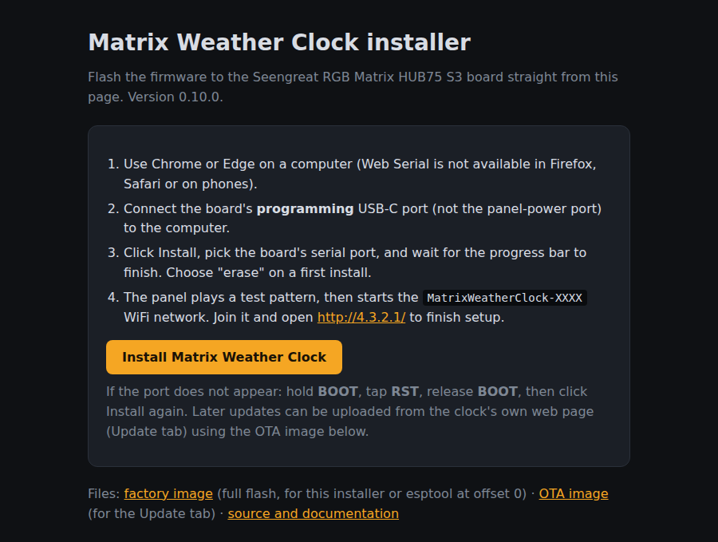

The same page works from your own machine, because browsers treat `localhost` as a secure origin:

```sh
cd installer
python -m http.server 8000      # then open http://localhost:8000/ in Chrome or Edge
```

Releases: pushing a tag such as `v0.4.0` (matching `MWC_VERSION` in `platformio.ini`) makes the workflow publish a
GitHub release with the images, checksums and generated notes; a tag with a suffix like `v0.4.0-beta` becomes a
pre-release.

`installer/` also holds the images directly: `matrix-clock-<version>-factory.bin` (whole flash, write at offset 0 with
esptool) and `matrix-clock-<version>-ota.bin` (upload from the clock's Update tab). Every push to `main` rebuilds the
firmware on GitHub Actions, republishes the installer and, through the manifest, offers the new version to every clock
that has automatic updates on; the images are also attached to each workflow run as an artifact. `python tools/make_installer.py --build` regenerates the folder locally.

## Automatic updates

Once a clock runs version 0.3.0 or later it keeps itself current: every six hours (configurable on the Update tab) it
reads the installer's `manifest.json`, and when a newer version is listed it downloads the OTA image over HTTPS, checks
the MD5 from the manifest, installs it with a progress bar on the panel and reboots. Automatic installs wait while an
alarm or timer is running. The Update tab shows the installed and latest versions and has "Check now" and "Install"
buttons; automatic installation can be switched off to install manually. The manifest URL is configurable, so a fork
can point its clocks at its own GitHub Pages site. The same manifest advertises the voice pack for the spoken
announcements; the clock fetches a new pack whenever the pack version changes.

## Building and flashing

Requirements: [PlatformIO Core](https://platformio.org/install/cli) (`pip install platformio`) and Python 3 (used
by the build script that embeds the web page). No Node.js needed.

```sh
pio run                 # first run downloads the ESP32-S3 toolchain and all libraries (several minutes)
pio run -t upload       # flash over the programming USB-C port
pio device monitor      # serial log, 115200 baud
```

If no serial port appears, hold **BOOT**, tap **RST**, release **BOOT**, then upload again. The board uses the
S3's native USB, so no driver is needed.

Later updates can be uploaded from the browser (Update tab) with `.pio/build/seengreat_hub75_s3/firmware.bin`; settings
are kept across updates.

## First-time setup

1. Power up. The panel shows a ten-second test pattern (solid colours, border, gradients, info text), then the clock
   with `SETUP WIFI` / `4.3.2.1` in the bottom half.
2. Connect a phone or laptop to the WiFi network **MatrixClock-XXXX** (open by default). The setup page should open
   automatically; otherwise browse to http://4.3.2.1/.
3. **WiFi tab**: pick your network (Scan), enter the password, Save & connect. The access point goes away once the
   clock is online.
4. **Location & Weather tab**: type your city or ZIP code, press *Find* and pick the match to fill in
   latitude and longitude (the lookup uses Open-Meteo's geocoding service from your browser), choose the time zone, units, and enter a contact e-mail. The NWS API requires a contact in every
   request; alerts stay disabled until one is set.
5. From now on the UI is at http://matrixclock.local/ (or the IP shown in the header).

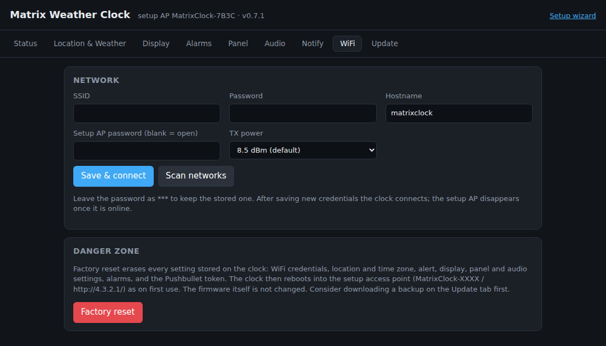

## Screens

Simulated renderings of the panel (same layout, fonts and colours as the firmware; the LED look is approximate).
Animated GIFs live in `docs/screens/gif/`, still PNGs of the same scenes in `docs/screens/`.

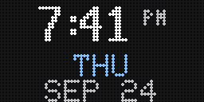

*Page rotation with slide transitions, then the forecast screen.*

| | | |
|---|---|---|
| 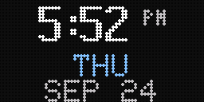 | 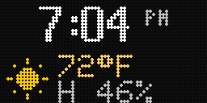 | 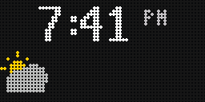 |
| Date page | Temperature | Conditions |
| 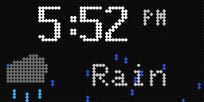 | 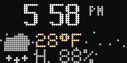 | 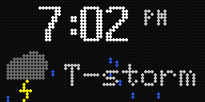 |
| Rain (animated) | Snow (animated) | Thunderstorm (animated) |
| 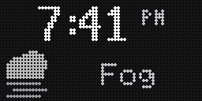 | 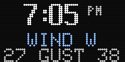 | 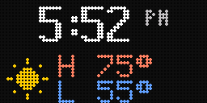 |
| Fog at night | Wind | High / low |
| 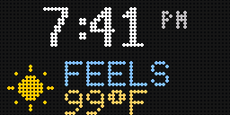 | 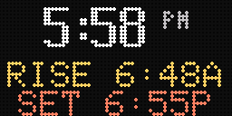 | 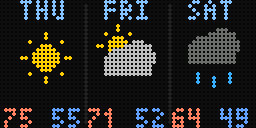 |
| Feels like | Sunrise / sunset | 3-day forecast |
| 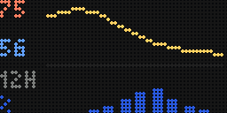 | 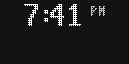 | 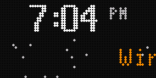 |
| 12-hour graph | Tornado warning (new alert) | Winter storm watch |
| 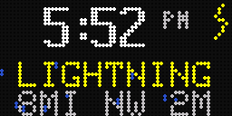 | 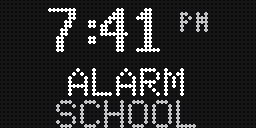 | 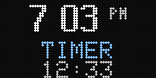 |
| Lightning nearby | Alarm ringing | Timer running |
|  | 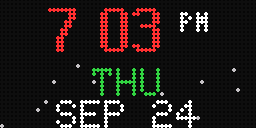 | 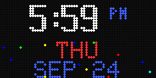 |
| Message | Christmas theme | Fourth of July theme |
| 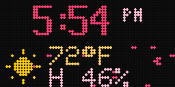 | 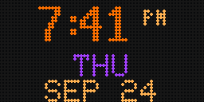 | 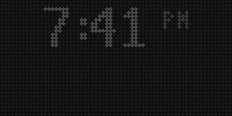 |
| Valentine's theme | Halloween theme | Night mode |
| 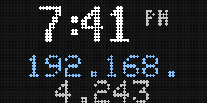 | 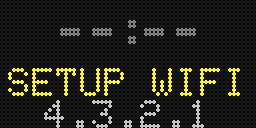 | 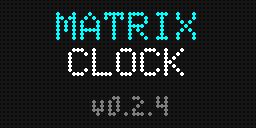 |
| IP after connecting | Setup access point | Splash |
|  |
| Test pattern |

### Weather alert screens

The banner scrolls the event and headline of every active alert, coloured by the highest severity: red for Extreme and
Severe, orange for Moderate, yellow for Minor. A one-pixel frame flashes for the first minute after a new alert ("new"
below); the clock stays visible throughout.

| | | |
|---|---|---|
|  |  |  |
| Tornado Warning (Extreme, new) | Hurricane Warning (Extreme, new) | Severe Thunderstorm Warning (Severe, new) |
|  |  |  |
| Flash Flood Warning (Severe, new) | Excessive Heat Warning (Severe, new) | Tornado Watch (Severe) |
| 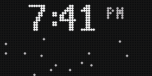 |  |  |
| Blizzard Warning (Severe) | High Wind + Red Flag Warnings (two alerts) | Winter Storm Watch + Wind Advisory (Moderate) |
| 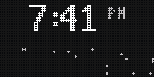 |  |  |
| Winter Weather Advisory (Moderate) | Heat Advisory (Moderate) | Dense Fog Advisory (Minor) |

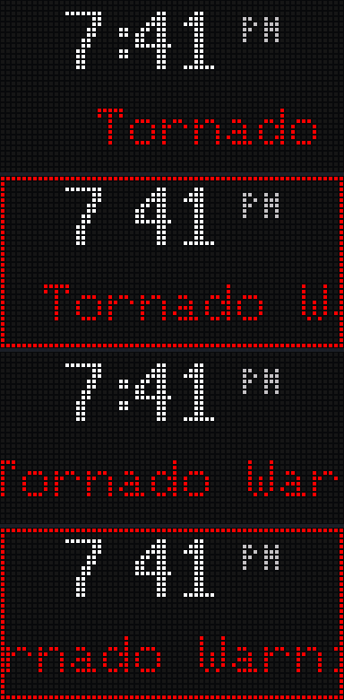

*Four frames, half a second apart: the banner scrolls left while the frame flashes.*

## Setup wizard and phone use

Phones and tablets get a simpler path. The setup access point opens the **setup wizard** at http://4.3.2.1/setup:
four short screens for WiFi (with a network list), location (city/ZIP search or coordinates), time zone and units,
and the NWS alert contact, saved in one go. It is also reachable any time from the "Setup wizard" link in the header
of the full page, or at http://matrixclock.local/setup.

The pages carry a web-app manifest, icons and the iOS meta tags, so "Add to Home Screen" gives you an icon that opens
the clock's page full screen like an app. On a phone the page shows a one-time hint with the two taps needed (Share →
Add to Home Screen on iPhone/iPad, browser menu → Add to Home screen on Android). Browsers only offer their own
install prompt over HTTPS, which the clock's plain-HTTP LAN page cannot provide; the hint covers that gap.

| | |
|---|---|
| 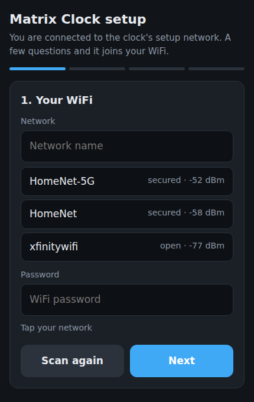 | 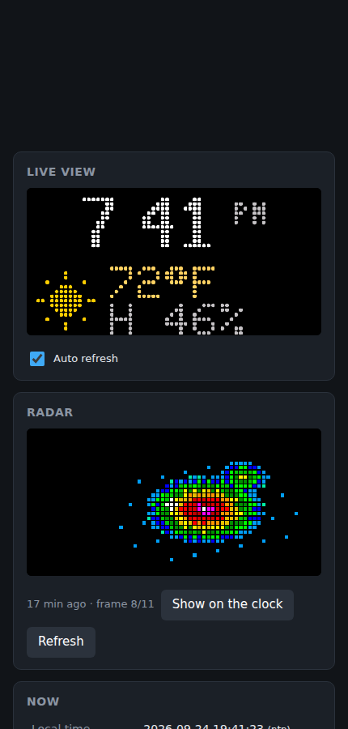 |
| Setup wizard on a phone | Full page on a phone with the home-screen hint |

## Web interface

Everything is configured from the clock's own page at http://matrixclock.local/. The Status tab shows a live view of
the panel, current conditions, active alerts with acknowledge and test buttons, and system health; the other tabs
hold the settings. Changes apply immediately except panel driver settings, which need a reboot.

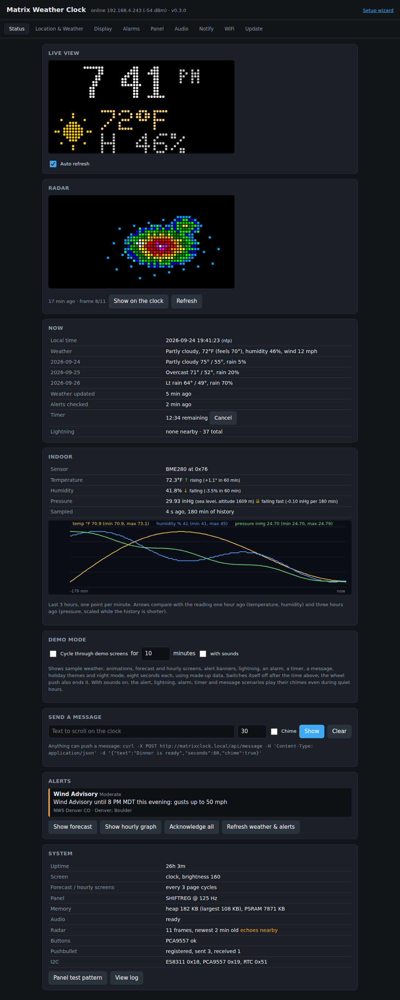

| | |
|---|---|
| 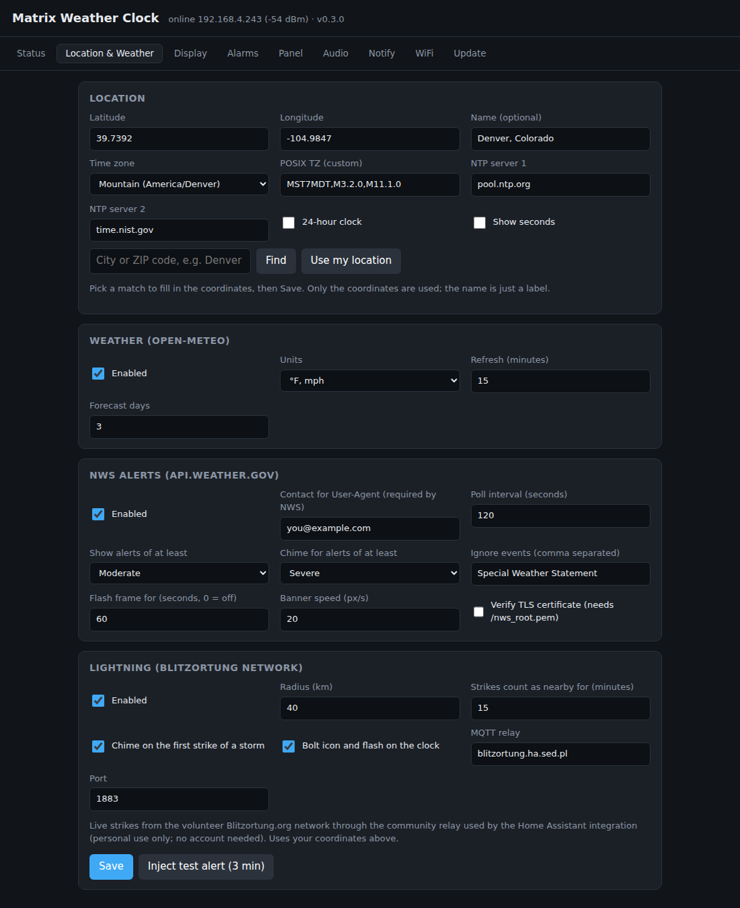 | 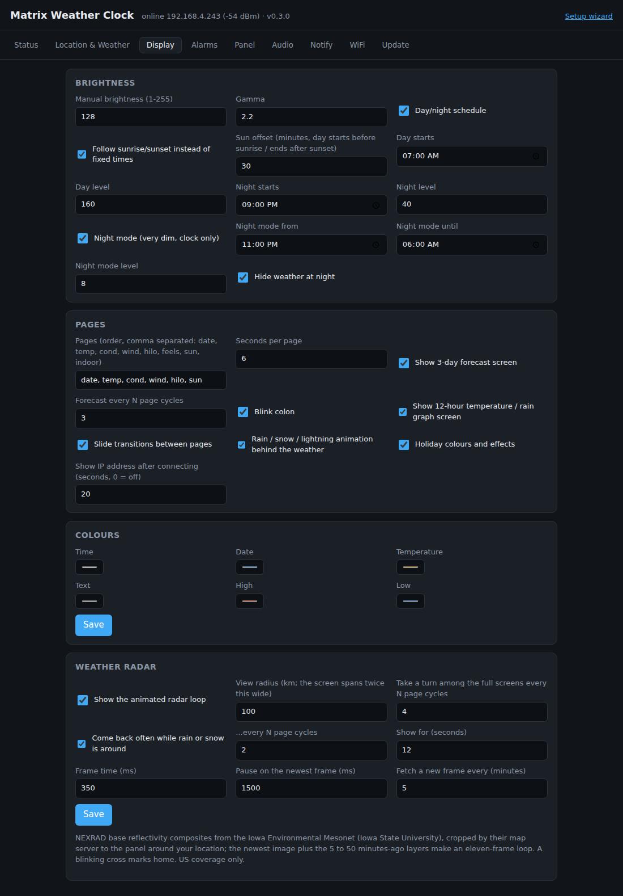 |
| Location & Weather: coordinates with city/ZIP search, time zone, units, NWS alert filters, lightning | Display: brightness schedule, night mode, pages, effects, colours |
| 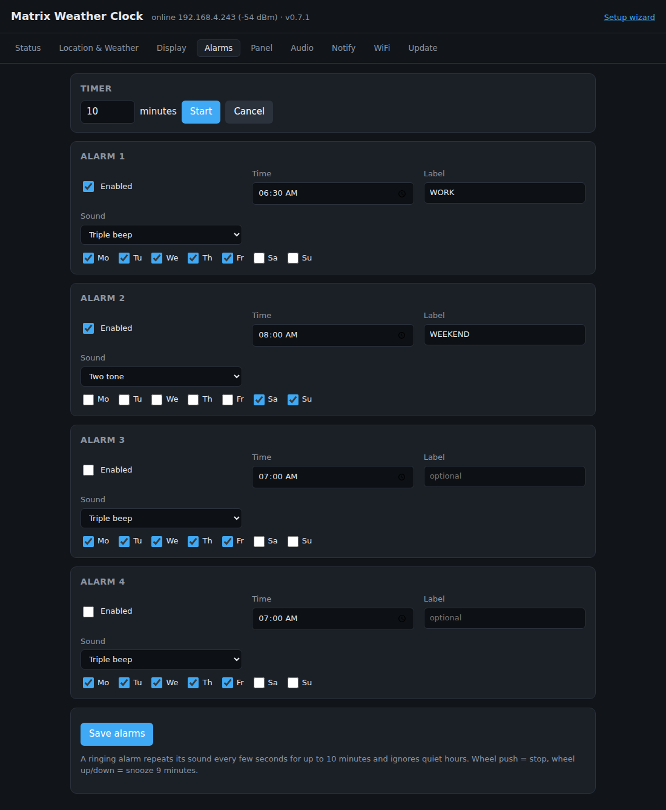 | 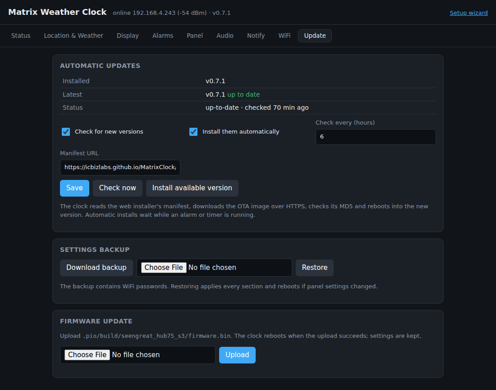 |
| Alarms: countdown timer and four alarms with weekdays | Update: automatic updates, settings backup, firmware upload |
| 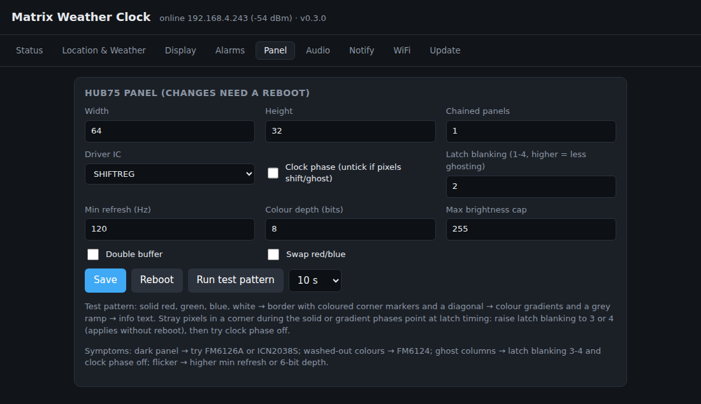 | 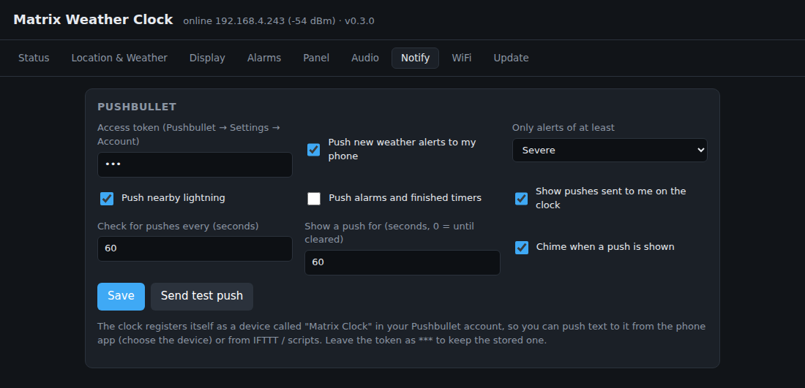 |
| Panel: HUB75 driver settings and the test pattern | Notify: Pushbullet notifications in both directions |
| 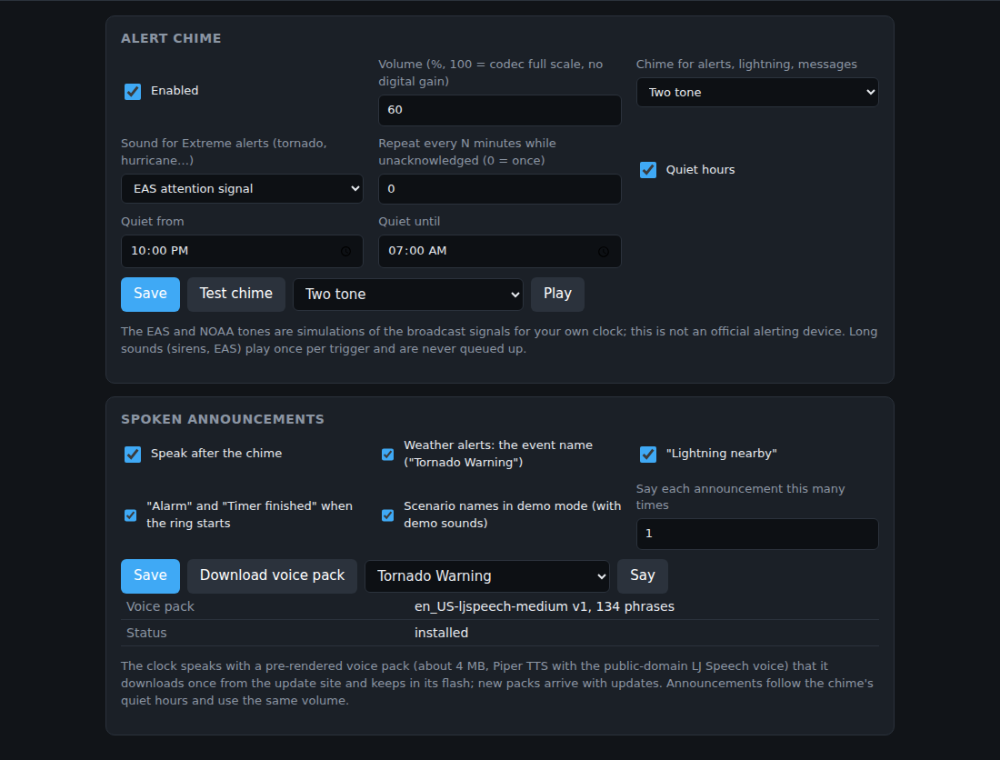 | 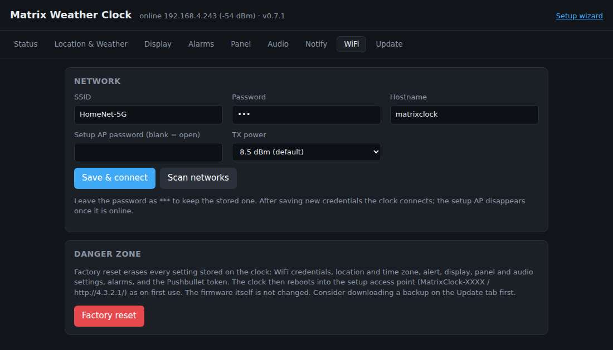 |
| Audio: chime, volume, quiet hours, spoken announcements | WiFi: network, hostname, setup AP password, factory reset |

Screenshots are taken from the real page served with sample data; images live in `docs/ui/`.

## What the screen shows

```
+----------------------------------------------------------------+
|  1 2 : 3 4  PM     <- time, 7x11 digits, AM/PM or seconds     |
|  [icon] 72°F        <- bottom half: rotating pages             |
|         H 46%                                                  |
+----------------------------------------------------------------+
```

Bottom-half pages (order and timing configurable): `date` (weekday, month day), `temp` (icon, temperature,
humidity), `cond` (icon and conditions text, scrolls if long), `wind` (direction, speed, gusts), `hilo` (today's
high/low), `feels` (feels-like temperature), `sun` (sunrise and sunset). Every few cycles the whole panel switches to
a full screen: the **forecast** (three columns with weekday, icon and high/low) alternating with the **hourly graph**
(temperature curve and rain-chance bars for the next 12 hours). Pages slide in from the right; when it is raining,
snowing or thundering, matching animation runs behind the weather pages. On holidays the clock changes colours and
adds an effect (snow at Christmas, confetti on New Year and July 4th, hearts on Valentine's Day, and so on).

When an alert is active the bottom half becomes a scrolling **banner** (`EVENT: headline`, all active alerts
in severity order) and a one-pixel frame flashes around the panel for the first minute. The clock stays visible.
In **night mode** the panel dims to the configured level and hides the weather, but an alert banner still shows.

Before the time is known the bottom half shows the connection state (`WIFI...`, `SETUP WIFI` with `4.3.2.1`, or the
IP address once online). After every WiFi connection the IP address is shown for 20 seconds (Display tab).

## Demo mode

The Status tab has a demo switch that cycles the panel through sample scenarios eight seconds each: sunny, rain, snow,
thunderstorm, lightning, wind, high/low, sun times, the forecast and hourly screens, a tornado warning and a winter
storm watch, an alarm, a running and a finished timer, a message, the holiday themes and night mode. It uses made-up
data, turns itself off after the chosen number of minutes, and the wheel push ends it early. It is silent unless
"with sounds" is ticked, in which case the alert, lightning, alarm, timer and message scenarios play their chimes even
during quiet hours. Scripts can use `POST /api/demo?on=1&minutes=10&sound=1`.

## Alerts in detail

- Polled every 2 minutes (configurable, minimum 60 s) from
  `https://api.weather.gov/alerts/active?point=lat,lon&status=actual&message_type=alert,update`
  (the endpoint rejects a `limit` parameter; the firmware keeps at most 12 alerts).
- Only alerts at or above the configured minimum severity are shown; events in the ignore list (for example
  `Special Weather Statement`) are hidden. The chime has its own, usually stricter, severity threshold.
- Updates to an alert you already saw inherit its state, so they do not flash or chime again. Cancelled alerts and
  alerts past their end time disappear on their own.
- After three failed polls in a row the banner marks the data as stale with a grey dot in the corner; the last known
  alerts stay on screen.
- **Acknowledge** (web UI or button K2) stops the flashing frame and any repeat chimes.
- Test without waiting for a storm: the Location tab has an *Inject test alert* button (3 minutes, Extreme), and
  `tools/find_nws_test_point.sh` prints coordinates inside a currently active real alert.

## Lightning

Optional, off by default (Location tab). The clock subscribes to the Blitzortung.org volunteer network through the
public MQTT relay used by the Home Assistant integration (`blitzortung.ha.sed.pl`, personal use only, no account) for
the map cells around your coordinates and keeps strikes inside your radius (default 40 km) for a window (default
15 minutes). While strikes are nearby: a bolt icon next to the clock, a bolt flash across the panel on every new
strike, a `LIGHTNING` page with distance, direction and age in the rotation, and a chime on the first strike of a
storm (then at most every five minutes, respecting quiet hours). Thunderstorm conditions from the weather data also
show lightning in the animation even without the network feed.

## Alarms, timer and messages

Alarms tab: up to four alarms with time, weekdays, label and sound. A ringing alarm shows `ALARM` and its label,
flashes an orange frame and repeats the sound every few seconds for up to ten minutes, ignoring quiet hours.
Wheel push (K2) stops it, wheel up/down snoozes for nine minutes; the Status tab has the same buttons. The timer
counts down in the bottom half and rings the same way.

Messages: `POST /api/message` with `{"text": "...", "seconds": 60, "chime": true, "color": "#40C0FF"}` scrolls the
text (0 seconds = until cleared with `POST /api/message/clear` or the wheel push). The Status tab has a form for it.

## Indoor sensor

Any board with a Bosch **BME280** (temperature, humidity, pressure), **BMP280** (no humidity) or **BME680 / BME688**
works: wire 3.3 V, GND, SDA to GPIO 1 and SCL to GPIO 2 of the controller (the same bus as the RTC and the codec). The
firmware finds the sensor at 0x76 or 0x77 by its chip ID at boot, adds an **indoor** page to the rotation (a house icon,
temperature, humidity and pressure) and shows the values on the Status tab with a three-hour chart. Keep the sensor a
few inches away from the panel and the controller, which run warm, or dial the offset in on the Location & Weather tab.

Each value carries a **trend arrow**: temperature and humidity are compared with the reading one hour ago (0.5 °C or
3 % RH to count as a change), pressure with three hours ago as weather services do (1 hPa; while the history is still
shorter the change is scaled up to the full window). A double arrow marks a fast change: three times the threshold,
for pressure a sign of a front moving through. Windows and thresholds live on the Location & Weather tab. Pressure is
shown reduced to sea level, which is what forecasts and weather sites quote, using the elevation Open-Meteo reports for
your location (or the altitude you enter); switch it off to see station pressure. `GET /api/indoor/history` returns up
to 24 hours at one point per minute for your own graphs.

## Spoken announcements

Right after the chime the clock can say what happened in a natural English voice: the NWS event name for a new alert
("Tornado Warning", "Winter Storm Watch", any of the 111 event types the NWS publishes, or "Weather alert" for one it
does not know), "Lightning nearby" for the first strike of a storm, "Alarm" or "Timer finished" when a ring starts, and
the scenario names in demo mode. Each can be switched off separately on the Audio tab, and an announcement can be
repeated up to three times. Speech follows the chime's quiet hours and volume.

The voice is not synthesized on the ESP32. A GitHub Actions step renders every phrase with
[Piper](https://github.com/rhasspy/piper) (voice `en_US-ljspeech-medium`, trained on the public-domain LJ Speech
recordings), stores the clips as 8-bit µ-law (clean enough that the small speaker, not the codec, is the limit) and
publishes them as a ~4 MB *voice pack* next to the firmware. When
speech is enabled the clock downloads the pack over HTTPS into its own flash file system, verifies the MD5 from the
manifest and keeps it across firmware updates; a new pack is fetched only when its version changes. The Audio tab
shows the installed pack, has a "Download voice pack" button and a phrase picker to hear any clip, and
`POST /api/test/say {"text": "Tornado Warning"}` does the same from a script. To rebuild the pack yourself, or with
another Piper voice, run `tools/make_voice_pack.py` (see its header for the file format).

## Pushbullet

Notify tab: paste an access token from Pushbullet's account settings. The clock registers itself as a device named
"Matrix Clock" and then pushes a note to your phone for new NWS alerts at or above the chosen severity, for the first
lightning strike of a storm (and at most every five minutes after that), and optionally for alarms. With "show pushes"
on it also polls your account and scrolls any push sent to all devices or to the clock: pick "Matrix Clock" in the
phone app, or use IFTTT / Home Assistant / `curl` against the Pushbullet API. Pushes the clock sent itself are ignored.

## Buttons (thumb-wheel switch)

| Key | Short press | Long press (1.5 s) |
|---|---|---|
| K1 | next page (snooze while ringing) | run the panel test pattern |
| K2 | stop a ringing alarm/timer, else clear a message, else acknowledge alerts | play a test chime (ignores quiet hours) |
| K3 | refresh weather and alerts now (snooze while ringing) | reboot |

## REST API

Everything the web UI does goes through JSON endpoints, so the clock can be scripted. The full list with the
configuration schema is in [docs/api.md](docs/api.md). Examples:

```sh
curl -s http://matrixclock.local/api/status | jq .
curl -X POST http://matrixclock.local/api/config -H 'Content-Type: application/json' \
     -d '{"display":{"brightness":40},"audio":{"volume":80}}'
curl -X POST http://matrixclock.local/api/test/alert -H 'Content-Type: application/json' \
     -d '{"event":"Tornado Warning","severity":"Extreme","headline":"Test until 5 PM","minutes":3}'
curl -F 'firmware=@.pio/build/seengreat_hub75_s3/firmware.bin' http://matrixclock.local/update
```

## Troubleshooting

| Symptom | What to try |
|---|---|
| Panel stays dark | Panel tab: driver `FM6126A`, then `ICN2038S`; save and reboot |
| Colours washed out / pastel | driver `FM6124` |
| Ghost columns, smeared pixels | latch blanking 3-4, clock phase off |
| Flicker | minimum refresh 150 Hz or higher, or colour depth 6 |
| Red and blue swapped | *Swap red/blue* |
| Leftmost column missing, stray pixels bottom right, image shifted one pixel | clock phase off (the default) or on |
| Board resets when the panel goes bright | panel power supply too weak; lower *Max brightness cap* |
| WiFi weak while the panel runs | raise TX power on the WiFi tab, route the ribbon cable away from the antenna |
| No chime | Status tab shows whether the ES8311 was found; check volume, quiet hours, speaker connector |
| Indoor page says NO SENSOR | Status tab → System lists the I2C addresses; a BME280/BME680 answers at 0x76 or 0x77 (check SDO/address jumper, 3.3 V, SDA on GPIO 1, SCL on GPIO 2) |
| Indoor temperature reads high | the board warms the sensor: move it on a short lead or set a negative offset on the Location & Weather tab |
| Sounds are fuzzy or distorted | Volume 100 % is the codec's full scale; the small speaker distorts near the top, so try 50-70 %. Firmware before 0.5.1 applied digital gain above 75 %, which clipped: update |
| Chime plays but nothing is spoken | Audio tab: the voice pack must show as installed; press "Download voice pack" (needs internet and about 4 MB of free flash), check `/api/log` for `voice:` lines |
| Keys do nothing | Status tab shows whether the PCA9557 expander was found; `/api/log` prints raw key states |

If a panel setting makes the board reset repeatedly, the firmware restores the panel defaults automatically after
three quick resets. To wipe everything (including WiFi): Factory reset on the WiFi tab, or `pio run -t erase`.

More detail: [docs/hardware.md](docs/hardware.md) (pins, panel notes, test pattern),
[docs/testing.md](docs/testing.md) (bring-up checklist with commands).

## Project layout

```
platformio.ini            build environment `seengreat_hub75_s3` (pioarduino, Arduino core 3.3 / IDF 5.5)
partitions/mwc_16MB.csv   two 3 MB OTA app slots + LittleFS
include/pins.h            every GPIO in one place
include/fonts/            7x11 clock digits
web/index.html            the web UI; tools/build_web.py gzips it into flash at build time
tools/make_voice_pack.py  renders the spoken phrases with Piper TTS into the voice pack (run in CI)
src/main.cpp              boot order and the 30 fps frame loop
src/app.*                 config staging from the web, reboot / factory reset
src/config/               settings struct, JSON load/save/validation (LittleFS /config.json)
src/display/              HUB75 bring-up, off-screen canvas with diff blit, renderer, icons, scroller, test pattern
src/net/                  WiFi + captive portal, network task, Open-Meteo and NWS clients, alert store, updater, voice pack download
src/time/                 NTP, time zone table, PCF85063 RTC driver
src/audio/                ES8311 codec, I2S chime synthesizer, ADPCM voice-clip player, voice pack index
src/io/                   I2C bus with device probing, PCA9557 expander, buttons, BME280/BME680 indoor sensor
src/web/                  async web server, REST API, OTA
docs/                     hardware, API and testing notes
```

Design notes: all network I/O runs in its own FreeRTOS task on core 0 so rendering never stalls on HTTPS; JSON
documents and the alert list live in PSRAM; only changed pixels are pushed to the DMA framebuffer each frame; the
panel clock is fixed at 8 MHz to keep WiFi usable next to the running matrix.

## Credits

[ESP32-HUB75-MatrixPanel-DMA](https://github.com/mrfaptastic/ESP32-HUB75-MatrixPanel-DMA) (panel driver),
[Adafruit GFX](https://github.com/adafruit/Adafruit-GFX-Library), [ESP32Async ESPAsyncWebServer and
AsyncTCP](https://github.com/ESP32Async), [ArduinoJson](https://arduinojson.org/). The ES8311 register sequence is
ported from Espressif's esp-bsp codec component (Apache-2.0). Spoken announcements are rendered with
[Piper](https://github.com/rhasspy/piper) (MIT) using the `en_US-ljspeech-medium` voice, trained on the public-domain
[LJ Speech](https://keithito.com/LJ-Speech-Dataset/) dataset. Weather data by Open-Meteo, alerts by the US National
Weather Service.
